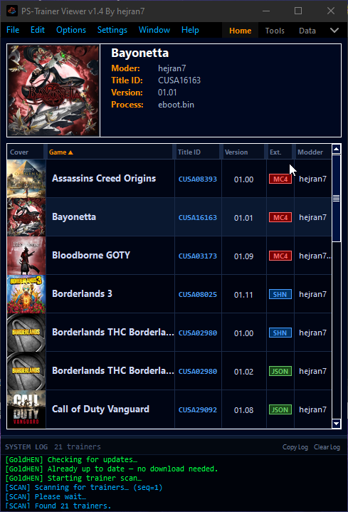
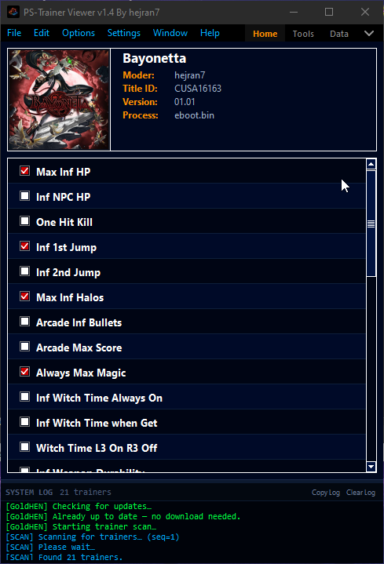
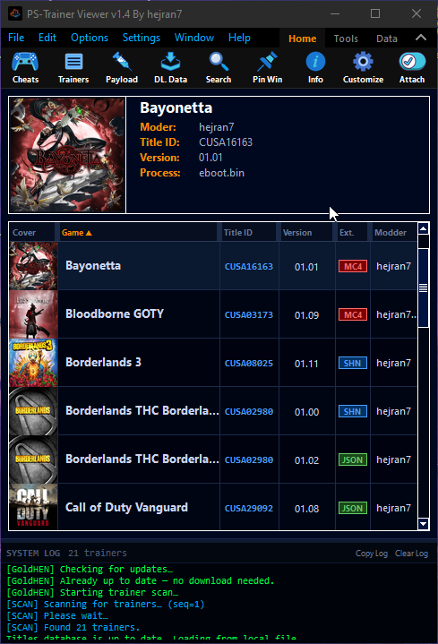
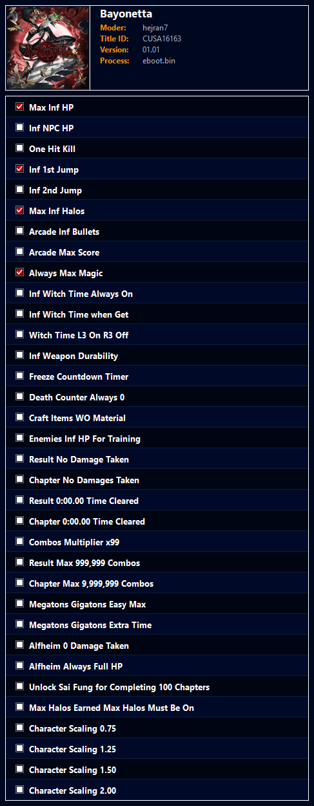

# PS-Trainer Viewer

A Windows desktop tool for loading, converting, and injecting PS4/PS5 cheat trainers over a local network connection via ps4debug / ps5debug.

Supports `.shn`, `.mc4`, and `.json` trainer formats. Connects directly to the console, reads the live Title ID and version, and writes memory patches in real time.

---

## App Previews

<table>
  <tr>
    <td></td>
    <td></td>
  </tr>
  <tr>
    <td></td>
    <td></td>
  </tr>
</table>


---


## First Launch

1. Extract the zip to any folder — no installer needed.
2. Run `PS_Trainer_Viewer.exe`.
3. If Windows Firewall blocks the connection, the app will prompt you to fix it automatically (requires UAC approval). This opens ports **744** and **755**.

---

## Antivirus / False Positives

> **Note:** Some antivirus programs may flag `PS_Trainer_Viewer.exe` as suspicious.

This is a **false positive**. The app is clean and contains no malware.
If your antivirus quarantines the file, you may need to add an exception for the `PS_Trainer_Viewer/` folder.

---

## Connecting to the Console

At the top of the Home tab:

- **IP** — enter your console's local IP address. Previous entries are saved in the dropdown.
- **Port** — PS4 uses `9090` by default, PS5 uses `9021`. Previous entries are saved in the dropdown.
- **Connect / Disconnect** — establishes or drops the ps4debug/ps5debug session.

Once connected, the header panel at the top will populate with the running game's Title ID, version, process name, and moder info (pulled from the loaded trainer file).

---

## Loading a Trainer File

**File → Open** to browse for a `.shn`, `.mc4`, or `.json` trainer file.

The app parses the file and:
- Displays the game title, Title ID, version, process name, and moder name in the header.
- Populates the cheat list in the Cheats tab.
- If the live console Title ID or version doesn't match the trainer, a warning dialog appears — you can still proceed.

---

## Cheats Tab

Each entry in the cheat list is a named toggle. Check the box next to a cheat to apply it, uncheck to revert.

- All active cheats are automatically disabled and reverted when you detach from the game.
- Cheats are written to memory immediately when toggled; no Apply button needed.
- On-screen notifications are sent to the console when a cheat is applied or reverted.
- Startup codes (if any are defined in the trainer) are applied automatically on attach.
- **Right-click** anywhere in the cheat list to go back to the Trainers tab.
- Press **Esc** while the cheat list is focused to return to the Trainers tab.

---

## Trainers Tab

A searchable list of all trainer files found in the local `trainers/` folder.

- **Single-click** a row to preview info.
- **Double-click** a row to load that trainer.
- The toolbar **Search** button shows a search bar — filter by game name, Title ID, or modder name.
- The column headers are sortable (click to sort, click again to reverse).
- **Show only matching trainers by Title ID** in General settings filters the list to only show trainers that match the currently running game.
- The **System Log** updates in real time with the number of results found when searching.

### Right-Click Menu

Right-clicking any trainer row opens a context menu with the following options:

| Option | Description |
|--------|-------------|
| **Load Trainer** | Loads the trainer and switches to the Cheats tab (same as double-click) |
| **Open Trainer Location** | Opens the containing folder in Windows Explorer with the file highlighted |
| **DL Store Data .json** | Downloads PSN store data JSON for that title (respects Store Data settings) |
| **Delete Trainer** | Prompts for confirmation then permanently removes the file from disk |

### GoldHEN Cheat Repository

Enabled by default under **Settings → General → Downloads → GoldHEN Cheat Repository**.

When checked, the app downloads the latest cheat files from the GoldHEN community repo on startup and merges them into the local trainers folder. If the repo hasn't changed since the last download, nothing is re-downloaded.

To update manually, uncheck and recheck the option, then save.

---

## Saving / Exporting

**File → Save** — overwrites the currently loaded file in its original format.

**File → Save As** — saves to a new file. The format is determined by the extension you type:

| Extension | Format |
|-----------|--------|
| `.shn` | Plain XML |
| `.mc4` | Encrypted XML |
| `.json` | Plain JSON |

**Save cheats addresses as Absolute** (Settings → General → File Format) resolves all relative section offsets to absolute memory addresses before saving. Cheats relative to section 0 convert instantly without a live connection — PS4 section 0 is always at `0x400000`. Cheats relative to other sections require an active game session so the app can read the live process map to resolve the correct base address.

---

## Game Cover Art

The header shows the game's cover art if it has been downloaded.

- Click **No Art / Click To Add Image** to browse for a cover manually (supports PNG, JPG, JPEG, WEBP).
- Cover images are stored locally in the `game data/` folder, keyed by Title ID.
- The Data tab provides options to download cover art and game info from the PSN store.

---

## Store Data (.json)

Store data JSON files contain PSN product info for a game (title, description, cover, etc.) and are downloaded from the PlayStation Network.

- **Settings → Store Data** controls which APIs are used and which JSON formats are saved.
  - **Download New API store data (.json)** — fetches from Sony's GraphQL endpoint.
  - **Download Old API store data (.json)** — fetches from Sony's Chihiro store endpoint.
  - **Default API on startup** — sets which API is active when the app starts.
- Store data is only downloaded when explicitly requested — never automatically on startup.
- To download store data for a specific trainer, right-click it in the Trainers tab and select **DL Store Data .json**.
- To download store data for all trainers at once, click the **DL. Data** toolbar button.
- **SC / SL title IDs** (legacy PS1/PS2 IDs) are skipped automatically as they do not exist on the PSN store. You can still add store data for these titles manually.

---

## Payload Sender

Under the **Tools** tab — sends the ps4debug or ps5debug payload directly to the console over the network.

- The app ships with built-in payloads for both platforms.
- You can point it at a custom payload file using the browse button.
- Switch between **Custom** and **Built-in** with the toggle button.
- On open, the app probes port 744 in the background to check if a debugger is already running on the console. If it detects one, the Inject button switches to **Injected** and is disabled — this prevents sending the payload a second time, which would crash the console.

---

## Screenshot

**Tools → Screenshot** captures the current cheat view (header + cheat list) and saves it as a PNG. Useful for sharing trainer previews.

---

## Settings

**Settings → General** opens the settings dialog:

| Option | Description |
|--------|-------------|
| Clear log when loading a new file | Clears the log panel each time a trainer is opened |
| Show log panel | Toggles the log panel at the bottom of the window |
| Show only matching trainers by Title ID | Filters the trainer list to the running game |
| Save cheats addresses as Absolute | Resolves offsets to absolute addresses on save |
| GoldHEN Cheat Repository | Downloads community cheats from GoldHEN on startup |

Settings are saved automatically per user in `game data/settings.json`.

---

## Log Panel

The panel at the bottom logs all connection events, cheat writes, API calls, search results, and errors in real time.

- Drag the handle above it to resize.
- **Copy Log** copies the full log contents to the clipboard.
- **Clear Log** wipes it.
- The log panel visibility and size are preserved between sessions.
- Search results show the count of matched trainers: `[SEARCH] Found 12 trainers matching "hejran7" (total: 3460)`.
- Delete actions are logged: `[DELETE] Removed "CUSA00004_01.07.shn" — 3459 trainers remaining.`

---

## Toolbar

The collapsible toolbar (arrow button top-right) exposes additional tabs: **Home**, **Tools**, **Data**, and sub-menus for File / Edit / Options / Settings / Window / Help.

- Clicking the **active tab again** while the toolbar is open closes it.
- The toolbar layout can be customized — drag buttons to reorder them.

---

## Trainer File Formats

The app reads and writes three formats:

**SHN**

**MC4**

**JSON**

---

## Folder Structure

```
PS_Trainer_Viewer/
├── PS_Trainer_Viewer.exe
├── trainers/          ← put your .shn / .mc4 / .json files here
├── game data/         ← cover art, store data JSON, and settings (auto-created)
│   ├── covers/        ← cover images keyed by Title ID
│   ├── store data/    ← PSN store JSON files
│   └── settings.json
├── payloads/          ← built-in ps4debug and ps5debug payloads
└── icons/
```

The `trainers/` folder is scanned on startup. Sub-folders are also scanned, so GoldHEN repo files (which extract into `shn/`, `mc4/`, `json/` sub-folders) are picked up automatically.

---

## Troubleshooting

**Can't connect to console**
- Make sure ps4debug/ps5debug is running on the console.
- Check the IP and port are correct.
- Run the app as Administrator, or use the built-in firewall fix when prompted.

**Cheats don't work after loading**
- Check the Title ID and version in the header match the running game.
- Make sure you are attached (not just connected) — click Attach after connecting.

**Trainer list is empty**
- Put trainer files in the `trainers/` folder next to the exe.
- Or enable GoldHEN Cheat Repository in settings to download them automatically.

**GoldHEN download never finishes**
- Check your internet connection.
- The download can take a minute the first time — watch the log panel for progress.

**Store data JSON not downloading**
- Make sure at least one of the API download checkboxes is enabled in Settings → Store Data.
- SC / SL title IDs (PS1/PS2 era) are not available on PSN and will be skipped automatically.


---

## Credits

hejran7

Special thanks to

[ShininGami](https://github.com/ScriptSK)

[Ctn](https://github.com/ctn123)

[TLH](https://github.com/TetzkatLipHoka)

[xZenithy](https://ko-fi.com/s/9960cc66fd)
